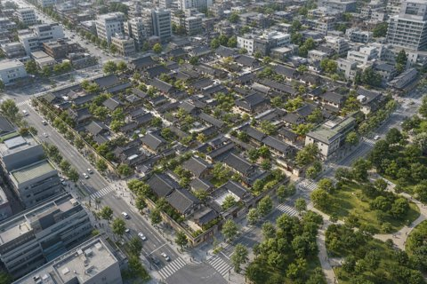

# 연구의 배경과 범위 {#연구-배경}

## 공간관리의 필요성 {#공간관리}

세계유산의 **탁월한 보편적 가치(OUV)를** 보존하려면 주변환경의 개발행위도 검토해야 합니다.[^scope]
AURI 편집양식 수록 보고서의 주제를 축약한 시험이며, 현재 제도·현황 안내가 아닙니다.

**보존과 개발의 관계**, *주변환경(wider setting)*, ***부처 간 협의***를 함께 살펴봅니다. 관련 자료는 [AURI](https://www.auri.re.kr "건축공간연구원")와 [**자료 안내**](https://example.net/report), <https://www.auri.re.kr>에서 확인합니다. URL https://example.net/raw 및 <test@example.net>은 글자로 표시합니다. 한글·English·0123456789·© ± ℃를 보존합니다.

세계유산구역과 완충구역을 검토합니다.  
주변환경까지 관리 범위를 확장합니다.\
검토 방법은 [다음 장](#관리-방안), [절](#협의-절차), [표](#tbl:roles), [](#fig:jpg)에서 확인합니다.

### 관리구역 {#관리구역}

#### 완충구역 {#완충구역}

##### 주변환경 {#주변환경}

###### 경관 검토[^heading] {#경관-검토}

각 수준의 번호는 [장](#연구-배경), [절](#%EA%B3%B5%EA%B0%84%EA%B4%80%EB%A6%AC), [3단계](#관리구역), [4단계](#완충구역), [5단계](#주변환경), [6단계](#경관-검토)로 참조합니다.

### 관리체계의 연계

문화유산 관리와 도시계획·경관관리의 연결을 검토합니다. 번호는 ID 없는 제목도 포함합니다.

## 조사 항목

- 유산의 가치와 공간적 특성을 확인합니다.[^list]
- **[이후 표](#tbl:roles)의** 검토 항목과 *[경관 검토](#경관-검토)도* 확인합니다.

느슨한 목록은 한 항목에 여러 문단을 담습니다.

- 관리계획과 관련 제도를 검토합니다.

  후속 문단에서 **강조 안의 각주[^span]와** [링크 표시문 안의 각주[^link]](https://example.net/note)를 확인합니다.

- 협의 주체와 자료를 정리합니다.

번호 목록은 시작 번호와 입력 구분자를 시험합니다.

3) 대상 사업을 확인합니다.

   같은 항목의 후속 문단입니다.

4) 예상 영향을 검토합니다.

중첩 목록은 여섯 수준의 서식과 혼합 구성을 확인합니다.

1. 유산
    1. 구역
        1. 주변환경
            1. 개발행위
                1. 경관
                    1. 검토 자료

다음은 글머리표와 번호를 함께 사용하는 목록입니다.

- 관리체계
    - 관계기관
        - 협의 범위
            - 자료 수집
                - 현장 확인
                    - 기록 보관
    1. 검토
        - 보완

반대 방향의 혼합 목록도 확인합니다.

1. 협의
    - 자료 검토
        1. 결과 정리

## 조사 자료와 원문

```
제목: 주변환경 검토 항목

   
대상 사업의 위치와 규모를 확인한다.
    네 칸 들여쓰기
	탭 들여쓰기

**강조**, [참조](#공간관리), [^scope]는 원문 문자 그대로 남는다.
```

출처: AURI 편집양식에 수록된 보고서의 논의를 요약·재구성.

주.1: **[공간관리 절](#공간관리)과** [검토 표](#tbl:roles)를 바탕으로 한 시험용 항목입니다.

translation.: md2hwp verification team.

제목 없는 글상자는 첫 줄부터 본문입니다.

```
첫 줄을 별도 제목으로 해석하지 않는다.
  원문의 공백과 문단 구분을 유지한다.
```

제목만 있는 글상자도 사용할 수 있습니다.

```
제목: 조사 범위 요약
```

, [다음 그림](#fig:jpg)](image.png "PNG 검증 자료"){#fig:png}

출처: 기존 md2hwp 검증용 PNG. 보고서의 실제 도면이 아닙니다.

주석2: *[다음 장의 그림](#fig:jpg)과* 캡션·장 번호를 비교합니다.

Source.: md2hwp image fixture.

# 관리방안의 검토 {#관리-방안}

## 협의 절차 {#협의-절차}

주변환경의 관리에는 관계기관의 협의와 제도 간 연계가 필요합니다. **[앞 장](#연구-배경)과** [PNG 그림][overview]을 다시 참조하고, 같은 각주도 재사용합니다.[^scope]

표: **검토 주체와 자료** — [앞 절](#공간관리), [그림](#fig:png)

{#tbl:roles}
| 검토 항목 | 순서 | 자료 | 비고 |
| :--- | :---: | ---: | --- |
| 관리 범위 | 1 | 3 | **[PNG 그림](#fig:png)과** [설명](https://example.net/table) |
| 협의 자료[^cell] | 2 | 12 | *[현재 절](#협의-절차)*, 빈 칸은 아래 표에서 확인 |

단위: 시험용 항목 수

note.3: 수치는 기능 검증용이며 실제 조사 통계가 아닙니다.

출처: [AURI 자료](https://www.auri.re.kr)의 논의를 재구성. [표 번호](#tbl:roles)도 참조합니다.

: 출처 없는 표

| 항목 | 결과 |
| --- | --- |
| 비어 있는 셀 | |

캡션 없이 출처만 있는 단일 열·머리행 전용 표입니다.

| 검토 자료 |
| --- |

참고: 본문 행이 없어도 표 머리행을 유지합니다.

캡션을 아래에 두는 입력도 시험합니다.

| 항목 | 결과 |
| --- | --- |
| 조사 자료 | *서식 확인* |

table: 아래쪽 표 캡션

비고: [앞의 표](#tbl:roles)를 함께 검토합니다.

캡션과 출처를 모두 생략한 표입니다.

| 점검 |
| --- |
| 문단 복귀 |

## 그림 자료의 형식

](image.jpg){#fig:jpg}

출처: 기존 PNG의 JPEG 변환본. 실제 조사 사진이 아닙니다.

{#fig:jpeg}

{#fig:emf}

참고: 저장소 생성기로 만든 재현용 그림입니다. [일반 JPG](#fig:jpg)와 번호를 비교합니다.

{#fig:dual}

{#fig:only}

## 종합 검토

*[앞 장의 그림](#fig:png)도* 검토하고, [최종 그림](#fig:only), [표](#tbl:roles), [절](#협의-절차)을 함께 참조합니다. 개체 뒤의 본문 서식 복귀를 확인합니다.

[^scope]: 세계유산의 **OUV**와 *주변환경*을 함께 검토합니다. [자료](https://www.auri.re.kr "AURI")를 참고합니다.

    둘째 문단에는 [다른 장의 그림](#fig:jpg), [표](#tbl:roles), [절](#협의-절차)을 넣습니다.  
    각주 안의 강제 줄바꿈도 유지합니다.

[^heading]: 여섯 번째 수준 제목에 붙인 각주입니다.
[^list]: 글머리 목록에 붙인 각주입니다.
[^span]: 강조 범위에 붙인 각주입니다.
[^link]: 외부 링크 표시문에 붙인 각주입니다.
[^cell]: 표 셀 각주에서 **[그림](#fig:png)과** [표](#tbl:roles)를 참조합니다.

[overview]: #fig:png
